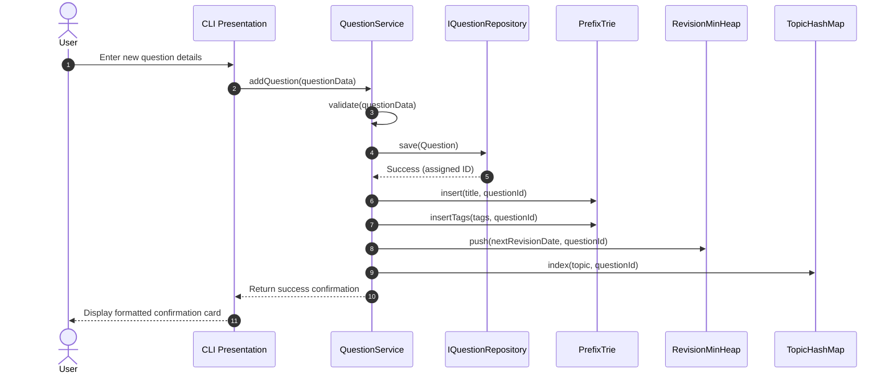
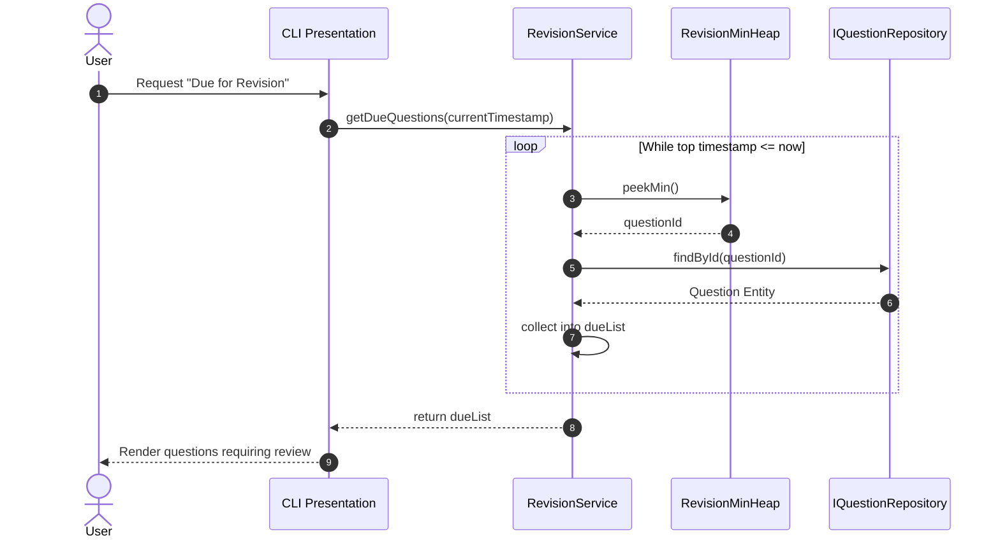

# CodeVault — System Architecture Specification

## 1. Executive Architectural Summary

CodeVault is engineered as a high-performance, modular desktop application adhering to Clean Architecture principles. It enforces strict separation between:
- Domain representation (entities)
- Underlying algorithmic data structures (DSA core)
- Application business orchestration (services)
- Data persistence mechanisms (repositories)
- User interaction boundaries (presentation)

This modularity ensures that the core Data Structures & Algorithms remain unpolluted by terminal I/O or storage formats, allowing the platform to transition seamlessly from a terminal utility to a desktop GUI or web-backed system in future stages.

---

## 2. High-Level Architectural Diagram

```mermaid
graph TD
    subgraph Presentation_Layer [Presentation Layer]
        CLI[Terminal CLI Shell - CliShell]
        ReactUI[React 18 + Vite + Tailwind Web UI]
        HttpServer[Embedded C++ HttpServer REST Gateway]
    end

    subgraph Service_Layer [Application / Service Layer]
        QS[QuestionService]
        SS[SearchService]
        RS[RevisionService]
        PS[PracticeService]
        StatS[StatisticsService]
    end

    subgraph Core_DSA_Layer [Core / DSA Engine Layer]
        Trie[PrefixTrie]
        MinHeap[MinHeap PriorityQueue]
        HashMap[Category & ID HashMaps]
        PracticeQueue[PracticeQueue FIFO]
        RecentStack[RecentStack LIFO]
        DList[Session DoublyLinkedList]
        SortEngine[Sorting & Comparator Engine]
    end

    subgraph Domain_Layer [Domain Models]
        Question[Question Entity]
        Enums[Difficulty, Status, Topic Enums]
    end

    subgraph Persistence_Layer [Persistence Layer]
        RepoInterface[IQuestionRepository Interface]
        FileRepo[FileQuestionRepository]
        Storage[(Local Flat Files / CSV)]
    end

    CLI --> InputHandler
    InputHandler --> QS
    InputHandler --> SS
    InputHandler --> RS
    InputHandler --> PS
    InputHandler --> StatS
    QS --> Formatter

    QS --> RepoInterface
    QS --> Core_DSA_Layer
    SS --> Trie
    SS --> HashMap
    RS --> MinHeap
    PS --> PracticeQueue
    QS --> RecentStack

    RepoInterface <|.. FileRepo
    FileRepo --> Storage

    Core_DSA_Layer --> Question
    Service_Layer --> Question
    RepoInterface --> Question
```

---

## 3. Layer Breakdown & Responsibilities

### 3.1 Presentation Layer (`src/app/`, `include/app/`)
- **Responsibilities**:
  - Capturing user inputs from the console.
  - Rendering interactive menus, tables, and status messages.
  - Sanitizing user input before dispatching requests to services.
- **Boundaries**:
  - Contains **zero** direct business logic.
  - Interacts exclusively with Application Services via clean function signatures.
  - Has no awareness of internal pointers, tree nodes, or heap arrays in the DSA core.

### 3.2 Application / Service Layer (`src/services/`, `include/services/`)
- **Responsibilities**:
  - Orchestrates business workflows across repositories and custom DSA structures.
  - Maintains state consistency between persistent storage and in-memory search/priority indexes.
- **Implemented Services (Stage 2, Stage 3, Stage 4 & Stage 5)**:
  - `QuestionService`: CRUD operations on questions, business validation, and automatic Trie and Revision synchronization.
  - `SearchService`: Fast prefix searching on question titles using `codevault::dsa::PrefixTrie`, full-field keyword scanning, multi-criteria filtering via `QuestionFilter`, and custom sorting via `mergeSort` / `quickSort`.
  - `RevisionService`: Spaced repetition scheduling (1, 3, 7, 14, 30-day deterministic schedule), due/upcoming queries, and priority queue management via `codevault::dsa::MinHeap` with 3-key tie-breaking and `IClock` abstraction.
  - `PracticeService`: Manages FIFO practice sessions, queue introspection (`getQueueQuestions()`, `isQuestionQueued()`), individual removal (`removeQuestionFromQueue()`), targeted practice filtering (`startSessionWithFilter()`), direct single-question practice verdicts (`recordPracticeAttemptForQuestion()`) coordinating with `RevisionService` and unlinking from queue, and deterministic 5-tier recommendation cascade (`getPracticeNext()`) via `codevault::dsa::Queue` (Stage 5 & Stage 10).
  - `RecentHistoryService`: Tracks recently inspected questions and navigation history via `codevault::dsa::Stack`.
  - `ProblemPlaylistService`: Manages bidirectional problem playlists and in-place insertions via `codevault::dsa::DoublyLinkedList`.
  - `StatisticsService`: Aggregates solve rates, topic breakdowns, difficulty distribution, status distribution, revision urgency/level breakdown, and practice history into a decoupled `DashboardSnapshot` with zero-division safety and zero-mutation guarantees (Stage 6).
  - `ImportService`: Ingests and validates question catalogs from JSON and RFC 4180 CSV with atomic SQLite transaction rollback, conflict strategies (`Skip`, `Overwrite`, `GenerateNewId`), owner scoping, and post-commit `PrefixTrie`/`MinHeap` synchronization (Stage 9.5).
  - `ExportService`: Generates human-readable Markdown study sheets and 3-column Anki-compatible TSV flashcard decks for spaced repetition review (Stage 9.5).

### 3.3 Core / DSA Engine Layer (`src/dsa/`, `include/dsa/`)
- **Responsibilities**:
  - Houses authentic, pedagogically transparent, custom data structures and algorithms (zero STL wrapper shortcuts for core project algorithms).
  - Operates deterministically on memory buffers, pointers, and comparator lambdas.
- **Implemented Custom Data Structures & Algorithms**:
  - `codevault::dsa::PrefixTrie`: Custom TrieNode tree with `std::unique_ptr` and child maps for $O(L)$ prefix lookup.
  - `codevault::dsa::MinHeap<T, Compare>`: Custom generic binary min-heap over contiguous vector buffer for $O(\log N)$ priority operations.
  - `codevault::dsa::Queue<T>`: Custom singly-linked FIFO queue with head/tail pointers for strict $O(1)$ enqueue and dequeue, non-destructive `toVector()` snapshotting, element `contains()` lookup, and $O(N)$ targeted `remove()` node splicing (Stage 3 & Stage 10).
  - `codevault::dsa::Stack<T>`: Custom singly-linked LIFO stack with top pointer for strict $O(1)$ push and pop.
  - `codevault::dsa::DoublyLinkedList<T>`: Custom bidirectional linked list with bidirectional iterators and $O(1)$ head/tail operations.
  - `codevault::dsa::mergeSort`: Stable recursive divide-and-conquer sorting algorithm ($O(N \log N)$ worst-case, $O(N)$ extra space) with custom comparator support.
  - `codevault::dsa::quickSort`: In-place sorting algorithm with median-of-three pivot selection, Lomuto partitioning, and tail-call recursion optimization ($O(\log N)$ stack frames).
- **Isolation Rules**:
  - Pure self-contained headers and source files.
  - Does not perform file I/O or console I/O.
  - Fully compliant with the Rule of 5 and RAII memory safety guarantees.

### 3.4 Domain Model Layer (`include/models/`)
- **Responsibilities**:
  - Holds plain-old-data (POD) structures and value objects representing domain concepts (`Question`, `Difficulty`, `Status`, `Topic`, `QuestionFilter`, `SortOptions`).
  - Contains pure entity validation logic (e.g., verifying that titles are non-empty and URLs are well-formed).
  - Defines query specifications and criteria filters (`QuestionFilter`) with `matches()` evaluation.

### 3.5 Persistence Layer (`src/persistence/`, `include/persistence/`)
- **Responsibilities**:
  - Abstracts serialization and deserialization of domain entities to disk.
  - Implements the Repository Pattern via the `IQuestionRepository` interface.
- **Stage 2 Implementation**:
  - Robust file-based storage (CSV / delimited records) with full CRUD disk persistence.
  - Automatic directory creation and atomic file flushing upon create, update, and delete.
  - Transparent escaping and unescaping of CSV delimiters, quotes, and multiline text.
  - Zero external database dependencies.
  - Thread-safe handle ready for multi-threaded or SQLite backends in subsequent stages.

---

## 4. Key Cross-Cutting Workflows

### 4.1 Question Insertion & Indexing Workflow


### 4.2 Spaced Revision Scheduling Workflow


---

## 5. Extensibility & Future-Proofing

1. **GUI & Web Frontend Swap**:
   Because `QuestionService` and the other services expose pure C++ interfaces returning structured vectors and result codes, the CLI shell can be augmented with or replaced by a Qt, Dear ImGui, or WebAssembly (Wasm) front-end without touching a single line of business or DSA code.

2. **Database Engine Evolution**:
   Implemented in Stage 9.1 (`SqliteQuestionRepository`), SQLite with WAL mode provides full ACID compliance while retaining zero-daemon simplicity.

3. **Multi-User Enablement & Authentication Architecture (Stage 9.2 & 9.3)**:
   - **Persistence**: SQLite Schema v3 with `users`, `user_credentials`, and `sessions` tables.
   - **Password Security**: Argon2id cryptographic hashing with per-user CSPRNG salt.
   - **Session Security**: Server-side sessions storing only Blake2b token digests; raw tokens transmitted via HttpOnly SameSite=Lax cookies.
   - **Identity Resolution**: `AuthenticatedCurrentUserProvider` feeds the authenticated user ID into `QuestionService`.
   - **Owner Scoping**: Repositories, queries, DSA indexes (PrefixTrie), and revision queues (MinHeap) are strictly isolated to the authenticated owner.
   - **CLI vs Web**: CLI operates in local-user mode (`StaticCurrentUserProvider("local_user")`), while HTTP REST API requires authenticated sessions.

4. **Account Management, Session Invalidation & Data Sovereignty (Stage 9.4)**:
   - **Profile & Credential Mutability**: `IAuthService` provides `updateProfile` and `changePassword` operations. Changing passwords enforces Argon2id verification of the existing password and re-hashes the new password with fresh CSPRNG salt.
   - **Multi-Device Session Invalidation**: `ISessionRepository::revokeAllForUserExcept` and `revokeSession` enable fine-grained remote session revocation or logging out all other devices while preserving the current active session.
   - **Safe Session Introspection**: `GET /api/auth/sessions` identifies the caller's active session via `isCurrentSession: true` without leaking tokens, hashes, or credentials.
   - **Personal Data Export**: `GET /api/user/export?format=json|csv` queries questions strictly through `QuestionService` ensuring owner isolation, and formats downloads into standard JSON or RFC 4180 compliant CSV.

5. **Catalog Import, Advanced Export & Data Portability Architecture (Stage 9.5)**:
   - **Ingestion & Conflict Resolution**: `ImportService` orchestrates JSON and RFC 4180 CSV parsing with three explicit conflict strategies (`Skip`, `Overwrite`, `GenerateNewId`).
   - **Atomic Transaction Rollback**: Batch operations execute within `saveAllAtomic` transactions (`BEGIN IMMEDIATE TRANSACTION ... COMMIT`); any failure triggers a full `ROLLBACK` to protect database integrity.
   - **In-Memory DSA Synchronization**: In-memory `PrefixTrie` and `MinHeap` structures update only after successful transaction commit, maintaining exact parity with persistence.
   - **Ecosystem Export**: `ExportService` generates human-readable Markdown study sheets and 3-column Anki-compatible TSV flashcard decks with tab escaping and normalized tags.
   - **Authenticated HTTP Gateway**: `POST /api/user/import`, `GET /api/user/export/markdown`, and `GET /api/user/export/anki` strictly enforce user authentication and owner scoping.
   - **Frontend Settings Workflow**: Dedicated Data Portability workspace in `SettingsPage.tsx` with drag-and-drop file upload, conflict strategy selector, and structured import summaries.

6. **Advanced Practice Workflow & Practice Queue Architecture (Stage 10)**:
   - **Service Orchestration**: `PracticeService` coordinates `dsa::Queue` (FIFO sequencing), `QuestionService` (problem metadata and persistence), and `RevisionService` (Leitner 5-box SRS scheduling and MinHeap extraction).
   - **Queue Mutations**: Custom linked-node `dsa::Queue<T>` provides $O(1)$ front/back operations, non-destructive `toVector()` snapshotting, element `contains()` lookup, and $O(N)$ targeted `remove()` node splicing.
   - **Deterministic Practice Next Cascade**: Algorithmic 5-tier recommendation cascade evaluating Active Queue Head $\to$ Overdue Revisions $\to$ Never-Practiced Unsolved $\to$ In-Progress $\to$ Stale Solved/Mastered with explainable rationale string ($< 1$ms, zero AI/LLM).
   - **Single-Question Verdict Integration**: `POST /api/practice/:questionId/result` records verdicts (`Solved`, `NeedsReview`, `Skipped`) from anywhere in the application, advancing Leitner spaced repetition intervals, persisting to SQLite, and unlinking from active queue.
   - **Targeted Practice Sessions**: Filtered session initialization (`POST /api/practice/session`) loading questions into the queue by topic, difficulty, status, company, or due status.
   - **Frontend Practice Experience**: Slide-out `PracticeQueueDrawer`, `StartSessionModal`, Practice Next CTAs on Questions list, Problem Detail workspace, and Dashboard, with post-verdict Leitner feedback cards and `N` keyboard navigation.
